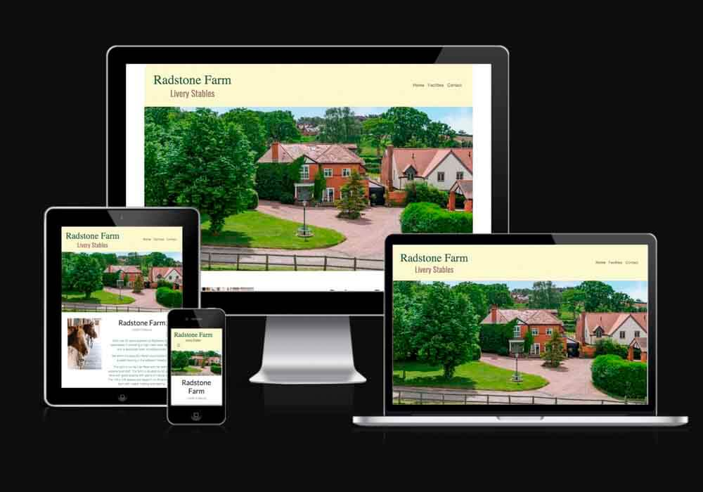

# RADSTONE FARM LIVERY STABLES
 
This website was designed based on a fictious livery yard as part of the Code Insitute Milestone 1 project.  The project was to build a static front end website using HTML, CSS and Bootstrap and/or other CSS libraries or frameworks. It is a responsive website that can be viewed on a wide range of devices.  

 

[View the Radstone Farm Livery Stables websitte here](https://louisejones101.github.io/Radstone-livery-stables-Milestone1/)

 

 
 

# Contents
 

* [User Experience (UX)](#ser-experience-(ux))
  * [Initial Discussion](#initial-discussion)
    * [Site Goals](#site-goals)
  * [User Stories](#user-stories)
    * [Potential Customer](#as-a-potential-customer)
    * [Administrator](#as-the-administrator)
  * [Design](#design)
    * [Colour Scheme](#colour-scheme)
    * [Typography](#typography)
    * [Imagery](#imagery)
  * [Wireframes](#wireframes)
    * [Home Page Wireframe](#home-page-wireframe)
    * [Facilities Wireframe](#facilities-wireframe)
    * [Contact Page Wireframe](#contact-page-wireframe)
    * [Mobile Wireframe](#mobile-wireframe)
    * [Ipad Wireframe](#ipad-wireframe)
  * [Page Features](#page-features)
  * [Accessibility](#accessibility)
  * [Future Implementations](#future-implementations)
* [Technologies](#technologies)
  * [Languages Used](#languages-used)
  * [Fameworks/Libraries/Programs Used](#frameworks-libraries-programs-used)
* [Testing](#testing)
* [Bugs](#bugs)
* [Deployment and Local Development](#deployment-and-local-evelopment)
  * [Deployment Instructions](#deployment-instructions)
  * [Local Development](#local-development)
    * [How Fork to Respository](#how-to-fork-the-repository)
    * [How to Clone the Repository](#how-to-clone-the-repository)
* [Credits Section](#credits-section)
  * [Code Used](#code-used)
  * [Content](#content)
  * [Media](#media)
* [Acknowledgements](#acknowledgments)

 
   

# User Experience (UX) 

 

## Initial Discussion

 

Radstone Farm Livery Stables is a website designed to showcase their facilities and services to potential clients.  The site consists of a home page highlighting the services and facilites at the stables as well as an about section.  It also contains a facilities page and also a contact page. 

 

### Site goals

 

The goal of the website is to allow potential users of the stables to take a look at the premises, find information about the stable facilities such as the riding school and tack room as well as see what services the stables provide. The users will be able to see the livery packages offered, their prices and also be able to contact the stables should they wish to.  The site needs to be accessible on various devices, easy to navigate and visually appealing.

 

## User Stories

 

### As a potential customer

 

* I want to find out about the stable and who runs it.

* I want to be able to see straight away that it is a livery stables.

* I want to be able to see visually with clear photographs what the stables/facilities look like.

* I want to see what services are provided by the stables. 

* I want to be able to see the livery packages available and their prices.

* I want to be able to find the contact details easily and contact the stables directly from the site if I have any questions.

* I want to be able to access the pages I need easily.

 

### As the administrator

* I want to add new facilities/services when needed.

* I want to be able to update the livery packages prices.

* I want to be able to add/change images.

 
 

## Design

 

### Colour Scheme
 
The color scheme that I dediced upon were earthy brown, green, and cream.  These are the type of colours that are seen in the equine industry.  Originally the colours that were going to be used were quite bold and vibrant but it became apparent as I was building the site that a more muted, pastel version of the colours worked better.

 
(colours images to go here)

 

### Typography

 

The fonts for this project were imported from Google Fonts (link in credits).  The fonts chosen were libre-baskerville for the main text on the site, Lato for the headings and Oswald for the small titles. 
 All three of these fonts are easy to read and spaced nicely. 

(screen shot of fonts to go here)

 

### Imagery

 

The pictures used fot his site were sourced from online websites that offer free images (these are listed in the credits section). 

The images were resized using Photoshop and compressed with Tiny PNG in order to reduce loading time.

 
 

# Wireframes

 

## Home Page Wireframe
## Facilities Wireframe
## Contact Page Wireframe
## Mobile Wireframe
## Ipad Wireframe

 
 

# Page Features

 

The website consists of a three accessible pages (home, facilities, contact) and a seperate thank you page that appears after the user has submitted a message via the contact form.

All pages contain a navigation bar with a menu and text logo and a footer containing links to the social media icons and copyright text.

 

## Logo and navigation menu

 

The logo contains the business name in their brand colours which acts as a link to the home page when clicked.  The navigation menu is a linear structure across the top of the page which then condenses down into a hamburger dropdown menu on small devices. The active page is hightlighted in bold text and in a different colour to the other links.

The footer contains icons which link to the social media accouts of the business and once clicked open in a serperate window.

All the buttons on the site become hightlighted in a slightly lighter colour when the user hovers over the button to encourage them to click.

(screen shot here)

 

## Front page

 

The front page has a landscape hero image leading into an about section.  Underneath the hero image there is an about section with an image to right. The text explains a bit about the livery stables and who runs it and has a call to action button allowing the user to jump straight to the livery section on the facilities page. The page layout becomes stacked when viewed on smaller devices and the about image is hidden. The next section on this page is a full length banner in list format which highlights the services that the stables provide. The final section on the front page is brief introduction to the different facilities at the yard such as the the riding facilities, tack room etc.  The text is accompanied by an image of the indoor school and the clear button linking the user to the facilites page to find out more. 

 

## Facilities page

 

When the user arrives on the facilities page they are greeted by a large clear image of the stable layout inside and a bullet list of the facilities.  Below this section are three titled images showing the tackroom, indoor arena and hacking available.

The final section on the facilities page contains three columns in an easy to read list format describing the different livery packages available and the prices.  Each livery service has been given a small star icon to show whether the package is full, part or DIY.  The columns contain a box shadow to give them a bit more definition on the screen. This section also contains a call to action button which encourages the user to visit the contact page if they have any questions.  On smaller devices the column layout becomes stacked.  

 

## Contact page

 

The final page that is available to the user directly is the contact page.  This has 
the title of the page and a sentence suggesting the user contacts the stables if they have any questions.  This is in a banner style with the background colour the same as the footer on the page.  The main body of the page has a slightly transparent background image to provide a bit of interest to the page.  On top of this image are two card columns.  The first column contains a contact form with clear labels for the users first name, surname, email and a text box to add a message.  The user must enter something in each box of the form in order to be able to send the message using the submit button.  In order to check that the form was working and the information that was entered was captured correctly, I connected the form to Code Institute from dump using the link that was provided in the love running project (as seen in the screen shots).  Then removed the link and replaced it with a link to the Thankyou page and then changed the method from post to get.  

In the second column of the Contact page there is similarly styled card to the contact form that contains the contact details of the stables, the address, telephone and email address.  Alongside the contact details are icons to represent the type of contact i.e a home icon for the address.    On smaller devices the columms become stacked and the icons alongside the contact details is hidden.

 

## Thank you page

The thank you page only becomes accessible once you have submitted a message.  The page has the same header and footer as the other pages and the same colour scheme.  The page is based on the contact page with the same background image and box layout.  The card-box contains a smiley face icon and some text thanking the user for sending a message and explaining expected timeframe the stables will get back to them.  It also contains a return to home button to take the user back to the home page should they wish.  Though they are able to access the other pages also with the navigation menu at the top.

 
 

# Accessibility

 
ggygy

 
 

# Future Implementations

 
 

# Technologies

 

## Languages Used

 

## Fameworks/Libraries/Programs Used

 
 

# Deployment and Local Development

 

## Local Development

 

## How Fork to Respository

 

## How to Clone the Repository

 
 

# Testing

   W3c Validator

  Lighthouse
  
  Testing User Stories
  
  Further Testing
  
 

## Bugs

 
 

# Credits Section

 

[Am I responsive](https://ui.dev/amiresponsive)

 

### Code Used

 

form dump CI

 

### Content

 

### Media

 
 

# Acknowledgments

 

