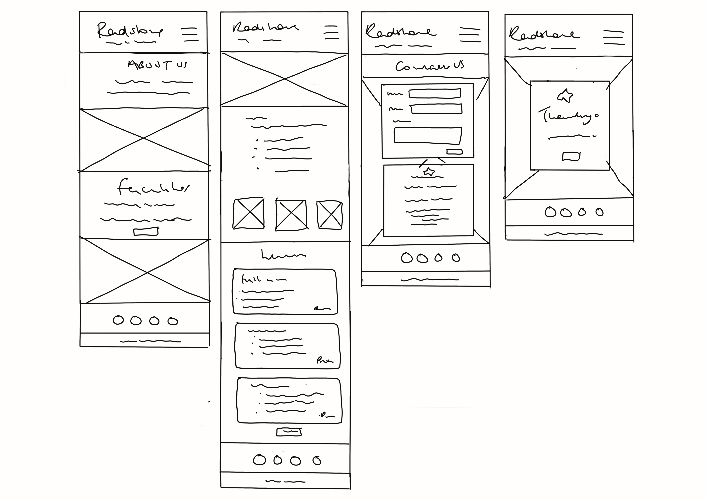
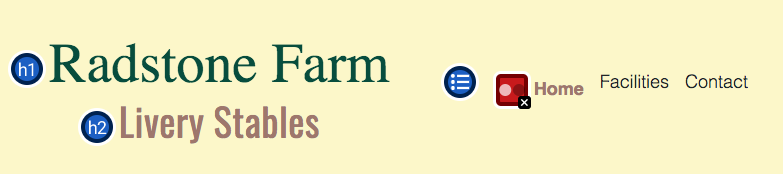
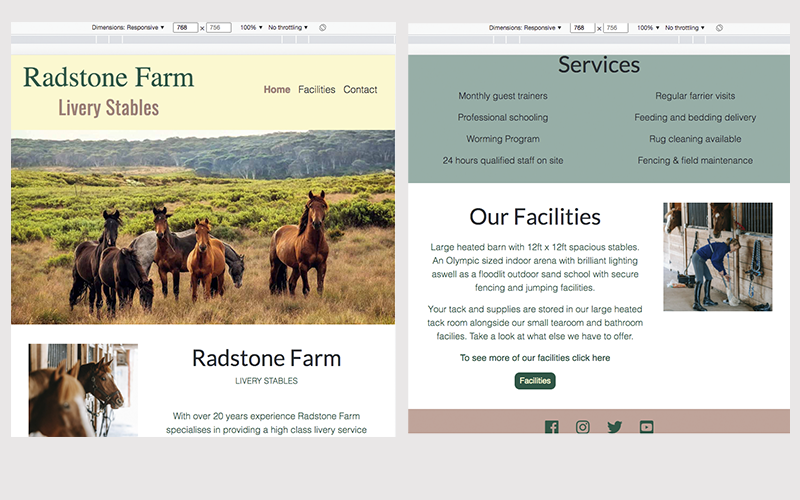
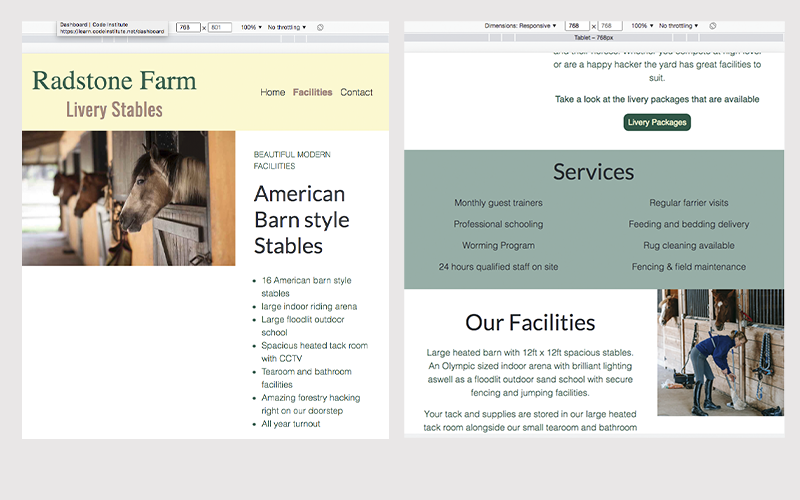

 

# RADSTONE FARM LIVERY STABLES
 
This website was designed based on a fictious livery yard as part of the Code Insitute Milestone 1 project.  The project was to build a static front end website using HTML, CSS and Bootstrap and/or other CSS libraries or frameworks. It is a responsive website that can be viewed on a wide range of devices.  

 
 

[View the Radstone Farm Livery Stables website here](https://louisejones101.github.io/Radstone-livery-stables-Milestone1/)

 

<kbd></kbd>

 
 

# Contents
 

* [User Experience (UX)](#user-experience-(ux))
  * [Initial Discussion](#initial-discussion)
    * [Site Goals](#site-goals)
  * [User Stories](#user-stories)
  * [Design](#design)
    * [Colour Scheme](#colour-scheme)
    * [Typography](#typography)
    * [Imagery](#imagery)
  * [Wireframes](#wireframes)
  * [Page Features](#page-features)
  * [Accessibility](#accessibility)
  * [Future Implementations](#future-implementations)
* [Technologies](#technologies)
  * [Languages Used](#languages-used)
  * [Fameworks Libraries and Programs Used](#frameworks-libraries-and-programs-used)
* [Testing](#testing)
  * [Accessibility Testing](#accessibility-testing)
  * [Responsiveness](#responsiveness)
  * [Browser Compatibility](#browser-compatibility)
  * [Features](#features)
  * [Testing User Stories](#testing-user-stories)
  * [Lighthouse](#lighthouse)
  * [W3C Validator](#w3c-validator)
  * [W3C Jigsaw](#w3c-jigsaw)
* [Bugs](#bugs)
* [Deployment and Local Development](#deployment-and-local-development)
  * [Deployment Instructions](#deployment)
  * [Local Development](#local-development)
* [Credit Section](#credit-section)
  * [Code Used](#code-used)
  * [Content](#content)
  * [Images](#images)
  * [information](#information)
* [Acknowledgements](#acknowledgments)

 
   

# User Experience (UX) 

 

## Initial Discussion

Radstone Farm Livery Stables website is designed to showcase their facilities and services to potential clients.  The site consists of a home page highlighting the services and facilites at the stables as well as an about section.  It also contains a facilities page and contact page.  

### Site goals

The goal of the website is to allow potential users of the stables to take a look at the premises, find information about the stable facilities such as the riding school and see the services provided. The users will be able to see the livery packages offered, their prices and also be able to contact the stables should they wish to.  The site needs to be accessible on various devices, easy to navigate and visually appealing.

 

## User Stories

### As a potential customer

* I want to find out about the stable and who runs it.

* I want to be able to see straight away that it is a livery stables.

* I want to be able to see visually with clear photographs what the stables/facilities look like.

* I want to see what services are provided by the stables. 

* I want to be able to see the livery packages available and their prices.

* I want to be able to find the contact details easily and contact the stables directly from the site if I have any questions.

* I want to be able to access the pages I need easily.

* I want to be able to access their social media pages.

 

## Design

### Colour Scheme

The color scheme chosen was an earthy brown, green, and cream.  These are the type of colours that are seen in the equine industry.  Originally the colours that were going to be used were quite bold and vibrant but it became apparent as the site was being built that a more muted, pastel version of the colours worked better.

 

<kbd></kbd>

 

### Typography

The fonts for this project were imported from Google Fonts (link in credits).  The fonts chosen were Libre-baskerville for the main text on the site, Lato for the headings and Oswald for the small titles. All three of these fonts are easy to read and spaced nicely. 

 

| Font 1 | Font 2 | Font 3 |              
|--------|--------|--------|
||||

 

### Imagery

The pictures used for his site were sourced from online websites that offer free images (these are listed in the [credit section](#credit-section)). The images were resized using Photoshop and compressed with Tiny PNG in order to reduce loading time.

 

## Wireframes

The wireframes for this project were created by hand on the Ipad in Procreate.

### Home page desktop wireframe

<kbd></kbd>

 

### Facilities page desktop Wireframe

<kbd></kbd>

 

### Contact Page desktop Wireframe

<kbd></kbd>

 

### Thank you page desktop wireframe

<kbd></kbd>

 

### Tablet Wireframes

<kbd></kbd>

 

### Mobile devices Wireframes

<kbd></kbd>

 

## Page Features

The website consists of a three accessible pages (home, facilities, contact) and also a seperate thank you page that appears after the user has submitted a message via the contact form.

All pages contain a navigation bar with a navigation menu, logo and a footer containing links to the social media icons and copyright text. All the buttons on the site become highlighted in a slightly lighter colour when the user hovers over the button to encourage them to click.

 

### Logo and navigation menu

The logo contains the business name in their brand colours which acts as a link to the home page when clicked.  The navigation menu is a linear structure across the top of the page.  The active page is highlighted in bold text and in a different colour to the other links.

 

<kbd></kbd>

 

| Smaller Devices                                |                                      |
|------------------------------------------------|--------------------------------------|
||On smaller devices such as an ipad or mobile the menu condenses down into a hamburger dropdown menu.|

 

The footer contains icons which link to the social media accounts of the business and once clicked they open in a serperate window.

 

<kbd></kbd>

 
 

### Front page

The front page has a landscape hero image leading into an about section. 

  

<kbd></kbd>

 
 

Underneath the hero image there is an about section with an image to left. The text explains a bit about the livery stables and who runs it and has a call to action button allowing the user to jump straight to the livery section on the facilities page. The page layout becomes stacked when viewed on devices smaller than a desktop and the about image becomes hidden on mobiles. 

 

<kbd></kbd>

 
 

The next section on this page is a full length banner in a list format which highlights the services that the stables provide. The final section on the front page is a brief introduction to the different facilities at the yard such as the the riding facilities, tack room etc.  The text is accompanied by an image and button linking the user to the facilites page to find out more. 

 

<kbd></kbd>

 
 

### Facilities page

When the user arrives on the facilities page they are greeted by an image some horses in the stables and a bullet list of the facilities.  

 

<kbd></kbd>

 
 

Below this section are three titled images showing the outdoor sand school, indoor arena and hacking available.

 

<kbd></kbd>

 
 

The final section on the facilities page contains three columns in an easy to read list format describing the different livery packages available and the prices.  Each livery service has been given a small star icon to show whether the package is full, part or DIY.  The columns contain a box shadow to give them a bit more definition on the screen. This section also contains a call to action button which encourages the user to visit the contact page if they have any questions.  On smaller devices the column layout becomes stacked.  

 

<kbd></kbd>

 
 

### Contact page

The final page that is available to the user directly is the contact page.  This has a title banner in the same colour as the footer for consistency.  The main body of the page has a slightly transparent background image to provide a bit of interest.  On top of this image are two card columns.  The first column contains a contact form with clear labels for the users first name, surname, email and a text box to add a message.  The user must enter something in each box of the form in order to be able to send the message using the submit button.  

 

<kbd></kbd>

 
 

In order to check that the form was working and the information that was entered was captured correctly, I connected the form to Code Institute from dump using the link that was provided in the love running project (as seen in the screen shots).  Once the form had been tested the link was then removed and replaced with a new link connecting to the Thankyou page.  Below are the screen shots of the code used to send the form details and the captured details.  

In the second column of the Contact page there is similarly styled card to the contact form.  This card contains the contact details of the stables, the address, telephone and email address.  Alongside the contact details are icons to represent the type of contact i.e a home icon for the address. On smaller devices the columms become stacked and the icons alongside the contact details become hidden.

 

### Form dump code screenshot

<kbd></kbd>  

 

### Form dump capture screenshot

<kbd></kbd>

 
 

### Thank you page

The thank you page only becomes accessible once you have submitted a message.  The page has the same header and footer as the other pages and the same colour scheme.  The page is based on the contact page with the same background image and box layout.  The card-box contains a smiley face icon, some text thanking the user for sending a message and stating a response timeframe.  It also contains a 'return home' button to take the user back to the home page should they wish.  Though are also able to access the other pages also with the navigation menu at the top.

 

<kbd></kbd>

 
 

## Accessibility

In order to make the site as accessible as possible I followed the [w3c guidelines](https://www.w3.org/WAI/test-evaluate/preliminary/). 

* The font families and font size were chosen for their readability.

* Colours for the backgrounds and the text where chosen to give as much contrast as possible for users to be able to see the text clearly.  During testing using [Wave](https://wave.webaim.org/) some of the text was flagged as having slight contrast issues so changes were made to improve this (discussed in [testing](#testing) below).

* Alt tags with clear descriptive text were given to each of the images on the site.

* A clear structure to the flow of the site and appropriate headings on the page in order of importance.

* Aria-labels added to the form and the social media icon links to allow them to be read by screen readers.

 
 

## Future Implementations

Future additions that could be added to the site:-

* A gallery with more photos showcasing the stables, maybe the staff and some of the horses.  

* A social media feed somewhere on the site so users can see some up-to-date content and to give a bit of extra interest to the site.

* A navigation menu and contact details in the footer.  As some of the pages have a bit of scrolling, the user can then click on a nav link at the bottom rather than scroll back up to the top which is currently the case.

* An events page that can be changed regularly to show the up and coming events at the yard and their details.

 
 

# Technologies

 

## Languages Used

Mainly HTML and CSS were used for this project along with bootstrap.

 

## Frameworks Libraries and Programs Used

Procreate - used for the wireframes

Git and Github - for version control, storing of files and deploying the site

Gitpod - used as the coding environment.

Bootstrap v5.2 - for the site frameworks using containers, columns.  Also used for some features on the site such as the navbar, cards and also for the responsiveness of the site alongside my own CSS code.

Google Fonts - used for the Typography on the page.

FontAwesome 5.6.1 - used for the icons to add a bit of visual interest to some of the information.

Google Dev Tools - to test the style features, layout of pages and responsiveness as the site was being built.

Photoshop - resizing of images

Tiny PNG - compression of images

W3C Markup Validation - to test HTML code

W3C Jigsaw - to test CSS code

Wave by Webaim - Used to check the accessibility of the site

 
 

# Testing

 

## Accessibility Testing

In order to test the accessibility of the site I ran the pages through [Wave](https://wave.webaim.org/) to see if there were any issues.

Below shows the some of the things it flagged during the test.  As you can see from the first screenshot below Wave flagged that the active navigation button (screenshot 1) and the text on the contact page under the heading (screenshot 3) did not have enough contrast against the background. I changed this to same colour as the livery stables text which was a slightly darker shade.  
  
On the facilities and contact page (screenshot 2) it suggested that the home link in the navigation menu should be different as they were the same as the the logo link.  However this is how it was intended to be so no changes were made.  Below is the results for each page after the changes were made (screenshot 4, 5, 6).

 

Screenshot 1
<kbd></kbd>

 

Screenshot 2
<kbd></kbd>

 

Screenshot 3
<kbd></kbd>

 

| Screenshot 4 | Screenshot 5 | Screenshot 6 |
|--------------|--------------|--------------|
|||

 
 

## Responsiveness

To test that the site is responsive on a wide range of sizes I used Google Dev Tools. Visually the website scaled down well from the desktop version to tablet devices, and the different average mobile sizes. 

### Contact page

The layout of contact page on tablet sized device (<768px) remains the same column layout as the desktop apart from the services layout becomes a two column list not four.   On a mobile devices (<425px) the image on the left of the about page is hidden, the list of services becomes a one column list and the image alongside the facilities section moves down underneath the text and becomes full width.

 

<strong>Contact page screenshots</strong>

|Tablet <768px|Mobiles <425px|   
|-------------|--------------|
||||

 

<strong>Facilities page screenshots</strong>

|Tablet <768px|Mobiles <425px|   
|-------------|--------------|
|||

 

<strong>Contact page screenshots</strong>

|Tablet <768px|Mobiles <425px|
|-------------|--------------|
|||

 
 

The table below contains responsiveness results for some of the standard devices in the Google Dev Tools options.

|Responsiveness|Iphone SE (375px)|Samsung Galaxy S8 (360px)|Ipad Mini (768)|Surface Pro 7 (912px)|Galaxy Fold (280px)|Nest Hub (1024px)|Notes               |
|--------------|-----------------|-------------------------|---------------|---------------------|-------------------|-----------------|--------------------|
|Text scales down as expected|yes|yes|yes|yes|yes|yes|
|Columns align as designed|yes|yes|yes|yes|yes|yes|
|Features hidden as should be|yes|yes|yes|n/a|yes|n/a|
|Nav menu compresses to hamburger|yes|yes|yes|yes|no|yes|Compresses down to hamburder but drops under the heading also contact us button on facilities page text no fully visible|
|links work|yes|yes|yes|yes|yes|yes|

 
 

## Browser Compatibility

I tested all of the website pages in three different browsers to check that everything worked, the layout and appearance remained as it should.  The three browsers I chose were the three I had easy access to on my Apple Macbook, Google Chrome, Firefox and Safari.  Everything worked as it should in Chrome and Firefox however in Safari the navigation menu was left aligned on devices larger than tablet size rather than right aligned as intended.  I am not sure if this was due to Safari being an old version and not up to date. (The operating system on my mac doesnt allow for update).

|   |Google Chrome|Firefox|Safari|Notes |
|---|-------------|-------|------|------|
|intended appearance|Good|good|Fair|Safari is an old version on my mac, it was all ok apark from the nav menu was left aligned but not right|
|intended responsiveness|Good|Good|Fair|

 
 

## Features

For this section I manually tested every feature on every page to ensure all the links/buttons/form did as they should.  Below are the results.

 

|Feature|Test|Outcome|
|-------|----|-------|
|Home page logo in left corner|Hover over|Shows a link to the index.html page|
|Navigation Menu links on home page|Click on|They all take you to the correct page|
|Home page 'Livery packages' button|Click on|Takes you to the correct section in on the livery page|
|Home page 'facilities' button|Click on|Takes you to livery page|
|Social media icons on home page|Click on|Take you to relevant social media in new window|
|Facilities page logo in left corner|Hover over|Shows a link to the index.html page|
|Navigation Menu links on facilities page|Click on|They all take you to the correct page|
|Facilities page contact us button|Click on|Link inactive - spelling mistake in code, changed and link was then correct|
|Social media icons on home page|Click on|Take you to relevant social media in new window|
|Contact us page logo in left corner|Hover over|Shows a link to the index.html page|
|Navigation Menu links on contact page|Click on|They all take you to the correct page|
|Form data imput boxes|Attempt to send the form without filling out all sections|Error message stating you all boxes are required|
|Form send button|Click on (after filling out correctly)|Takes you to a Thank you page|
|All links on thank you page and button|Click on|Working correctly|

 
 

## Testing User Stories

|User Story|Testing|
|-------|----|
|I want to find out about the stable and who runs it.|Home page first section has write up about the stables and the owners name.|
|I want to be able to see straight away that it is a livery stables.|Livery Stables is in the Header of each page and mentioned throughout the site|
|I want to be able to see visually with clear photographs what the stables/facilities look like.|Photographs showing the horses, the facilities and the owner|
|I want to see what services are provided by the stables.| Services are listed on the front page|
|I want to be able to see the livery packages available and their prices.|A livery package cta button is on the front page.  This then takes you to a livery section where the information of each package and prices are clearly listed|
|I want to be able to find the contact details easily and contact the stables directly from the site if I have any questions.| Contact links on nav of every page.  Contact page has all the contact information clearly set out as well as a contact form|
|I want to be able to access the pages I need easily.|All pages are able to be accessed via the navigation bar and cta buttons positioned on each page|
|I want to be able to access their social media pages.|Social media icons in the footer of each page|
  
 
 

## Lighthouse

As part of the testing I used Lighthouse in Google Chrome to test the performance, accessibility, best practices and SEO.  I tested both the desktop and the mobile version.  Lighthouse rated the website on both desktop and mobile as really good.  On both the desktop and mobile it scored 100% in accessibility and SEO and 92% in best practises.  For performance, the site on desktop scored  97% and the mobile 99%.  Below are screenshots of the results from the lighthouse panel.

 

| Lighthouse Desktop | Lighthouse Mobile |
|--------------------|-------------------|
|||

 

## W3C Validator

The HTML code from each page on the site was copied into the validator to check it.  On the home page it highlighted that the first 'section' would be better off as a div as it did not contain a heading.  I changed it on this page and the others before I took a screenshot of the validator screen.  So unfortunately I only have a screenshot of the code results after it had been changed.

The Facilities page showed that there was an issue with two of the 'p' tags in the card columns.  When I checked the code the closing 'p' tags were in the wrong place. I remembered to take a screen shot of the initial result this time before the changes were made.

On the Contact page I had used a unordered list for the contact address, email and telephone number using 'br' to create space.  It highlighted that breaks should not be used in a unordered list so I removed the list format all together and replaced them with the 'address' tag and 'br' for the space I needed in order to get the ions level.  If there was more time an better alternative could be looked at.

The Thank you page went through the validator without any changes needed.

 

<strong>Home page after changes</strong>

<kbd></kbd>

 

| Facilities page before | Facilities page after |
|------------------------|-----------------------|
|||

 

| Contact page before | Contact page after |
|------------------------|-----------------------|
|||

 

<strong>Home page after changes</strong>

<kbd></kbd>

 
 

## W3C Jigsaw

To check the CSS code I copied and pasted the code into the w3c css validator.  It highlighted one error with a 'position: center'.  It was meant to be "text-align-center".  After the change had been made in the CSS file, the code was re-run through the validator and came back with no errors.

 

| CSS before | CSS after |
|------------------------|-----------------------|
|||

 
 

# Bugs

I have been testing throughout the build using Google dev tools and fixing problems as they arised.

There was a Layout issue with the navigation menu in SAFARI browser.  I was unable to check if this is just because the version is old or if the bug is there on newer updated versions because the macbook os system being used cannot be upgraded.

There were text contrast issues with the nav menu when tested with Wave.  The colour was adjusted slightly to give it more contrast.  Wave also highlighted that the home link in the logo and nav bar were next to each other and therefore could cause confusion to a screen reader.  However I did not change this as I wanted the nav link to be visible aswell as have the option to return to the home page if you click on the logo.

Responsiveness - the hamburger menu alignment on very small screens 280px (ie galaxy fold) and the contact button on this size device also were not aligned as suppposed to be.  I did not change this due to time constraints.

Lighthouse highlighted that the images on home page could have been sized smaller.  The images were resized in Photoshop and then reloaded on to site before running Lighthouse again.

There was a problem with the code used in the contact card (used an unordered list and breaks together. Unordered list was removed and replaced with different code.  This then created a bug with the responsiveness of that section. The layout was not as was expected on small devices.  It was corrected by changing column widths, paddings etc.

I noticed after I had done all the tests and written this readme whilst doing a final check on the site before submitting that the prices of the livery packages has aligned themselves left.  Bug fixed.

 
 

# Deployment and Local Development

## Deployment

The site is deployed using GitHub pages

To deploy the site:-

1.  Log in or sign up to Github
2.  Click on the respository name
3.  Click on settings
4.  Find Pages on the lefthand side menu and click
5.  Scroll to Build and Deployment section
6.  Make sure the Deploy from a branch is selected in the Source box
7.  In the Branch dropdown menu select Main and root and then save.

You will then see a notification at the top of the page to say that the site is live and a link to visit the site.  This may take a few minutes.

 

## Local Development

How to fork the respository:-

1.  Log in or sign up to Github
2.  Click on the respository name
3.  Click on Fork in the top-right hand corner of the page
4.  Select the owner of the respository
5.  Add a description of your fork (optional)
6.  Copy the main branch only (default)
7.  Click on the create Fork button

 

How to clone the repository:-

1.  Log in or sign up to Github
2.  Click on the Code button above the list of files
3.  Copy the repository URL
4.  Open the terminal
5.  Change the working directory to where you want to put the cloned directory
6.  Type 'git clone' and then add the URL
7.  Press enter

 
 

# Credit Section

 

## Code Used

Code Institute and Bootstrap documents for inspiration for the form and how to add a textbox - (https://getbootstrap.com/docs/5.2/forms/layout/)

Bootstrap Navbar Menu, code adjusted and changed to suit- (https://getbootstrap.com/docs/5.2/components/navbar/)

Image opacity pseudo class, code adjusted for needs of this site - (https://stackoverflow.com/questions/4997493/set-opacity-of-background-image-without-affecting-child-elements)

Code Institute - Form dump (https://formdump.codeinstitute.net/)

Hamburger drop down menu - Code Institute  -  'bootstrap your next big idea" code adapted to suit what I needed it to do.

Bootstrap Cards, some of the code used and then adjusted to the needs of this site - https://getbootstrap.com/docs/5.2/components/card/

Box shadows - https://www.w3schools.com/css/css3_shadows_box.asp

  

## Content

Am I responsive - (https://ui.dev/amiresponsive)

Colour palette generator - coolors - (https://coolors.co/22292f-035746-caa59b-fcf8cf)

 

## Images

Hero image on home page by Christine Mendoza - (https://www.unsplash.com)

Images 1 & 2 on home page by Barbara Olsen (https://www.pexels.com)

Image 1 on facilities page - Stables by Engin Akyurt on unsplash (https://www.unsplash.com)

Image 2 on facilities page - girl on horse outdoors by Prostooleh - (https://www.freepik.com/author/prostooleh)

Image 3 on facilities page - indoor school by Kireyonok Yuliya (https://www.freepik.com/author/kireyonok-yuliya)

Image 4 on facilities page by Beth Macdonald (https://unsplash.com/photos/7Y8gfWM-1dw)

Contact & Thank you page background image by Andrey Petkov (https://www.pexels.com)

 

## Information 

How to link a button to specific section on a different page - (https://stackoverflow.com/questions/62307831/button-that-links-to-another-page-specific-part)

Wordpress Markdown Cheetsheet - (https://wordpress.com/support/markdown-quick-reference/)

How to fork and clone a repository - (https://docs.github.com/en/get-started/quickstart/fork-a-repo)

w3c accessibility guidelines checklist - https://www.w3.org/WAI/test-evaluate/preliminary/

 

# Acknowledgments

My mentor Elaine Roche for answering all my questions.
Student support and Iris the cohort facilitator for checking in on me and encouraging me to keep going when I was 6 weeks behind schedule due to work commitments.  
Tutor support for giving me advice on how to use Github when I first started.

 

